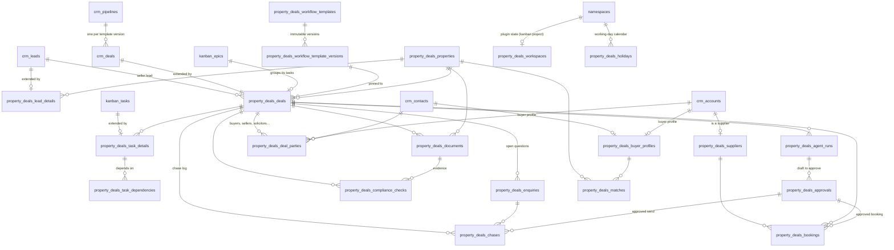

# Property Deals data model

Existing OpsAPI tables (CRM, kanban, users) are reused. The plugin's own tables, prefixed
`property_deals_`, only hold what those don't (see [00-gap-map.md](00-gap-map.md)).

Every table has `namespace_id`. Every reference is a uuid column with a real foreign key, plus a
`BEFORE INSERT/UPDATE` trigger (`property_deals_same_namespace`) that refuses a reference to a row
in another workspace. That holds for the API, jobs and agents alike.

| Table | Holds | Notes |
|---|---|---|
| `property_deals_properties` | address, UPRN, lat/lng, title, tenure, lease, EPC, condition, known issues, tenancy, valuations | lat/lng indexed for map queries |
| `property_deals_lead_details` | lead kind, situation, deadline, vulnerability, consent, retention | 1:1 with `crm_leads` |
| `property_deals_buyer_profiles` | entity type, funds, proof of funds, strategies, areas, price range, deal-breakers | on exactly one contact or company |
| `property_deals_workflow_templates` / `_versions` | editable template + immutable JSON versions | [template-format.md](template-format.md) |
| `property_deals_deals` | type, stage, prices, fees, target dates, late penalty, health, money at risk | 1:1 with `crm_deals`; stage set only by the engine |
| `property_deals_deal_parties` | role + contact/company on a deal | |
| `property_deals_task_details` | pd_status, SLA, due time, urgency + why, blocking, compliance, agent, approval rule, snooze, evidence | 1:1 with `kanban_tasks` |
| `property_deals_task_dependencies` | task → prerequisite | cycles refused by the API |
| `property_deals_enquiries` | open legal questions / missing items, who they wait on | |
| `property_deals_chases` | every chase: to whom, channel, sent, reply, outcome | on a deal or (before there is one) a lead |
| `property_deals_suppliers` | kinds, coverage, accreditations, prices, booking method, measured speed | 1:1 with `crm_accounts` |
| `property_deals_bookings` | supplier slot, status, cost | |
| `property_deals_compliance_checks` | check, subject, status, evidence, who/when, expiry | pass/waive needs a named person (DB check + API) |
| `property_deals_documents` | MinIO objects on a deal/property/task | key `property-deals/<ns>/<doc>/<file>` |
| `property_deals_agent_runs` | provider/model or JobShout ids, input, steps, draft, tokens, cost | |
| `property_deals_approvals` | what is to be sent/done, payload hash, rule, decisions | nothing leaves the system without one |
| `property_deals_matches` | property ↔ buyer score + breakdown | |
| `property_deals_holidays` | non-working days per workspace | seeded from GOV.UK (England & Wales) |
| `property_deals_workspaces` | kanban project/board, setup time | |
| `property_deals_digest_log` | one digest per person per local day (+ the digest writer's prose) | |
| `property_deals_notification_prefs` | push / email per category, quiet hours, per person | no row = everything on |
| `property_deals_ai_routes` | model chain (fallback order) per job type, local-only, max tokens | Phase 5 |
| `property_deals_agent_configs` | per agent: on/off, built-in or JobShout (+ agent id), local-only, approval rule, auto pickup | Phase 5 |
| `property_deals_mail_connectors` | IMAP / Gmail / Microsoft 365 mailbox config + sealed secret, sync cursor | Phase 5 |
| `property_deals_inbound_messages` | fetched email (data only), matched deal, chase it replied to, agent run it started | Phase 5 |

| `property_deals_connectors` | data sources: EPC, Price Paid, Companies House, postcodes, CSV, paid-feed stubs; sealed key | Phase 6 |
| `property_deals_market_records` | sold prices, EPC certificates, listings, auction lots (other people's homes: comparables and scouting) | Phase 6; not the workspace's own properties |
| `property_deals_saved_searches` | pin + radius or polygon + filters the deal scout re-runs | Phase 6 |
| `property_deals_scout_alerts` | new / reduced / stale / cash-only homes per saved search | one alert per home, kind and price |

Core tables added in Phase 5 (any module can use them):

| Table | What | Notes |
|---|---|---|
| `namespace_ai_providers` | a workspace's model endpoints and JobShout link | key sealed AES-256-GCM (`helper/secret-box.lua`), never returned |
| `idempotency_keys` | `Idempotency-Key` → first response, per workspace + user, 24 h | `helper/idempotency.lua` |
